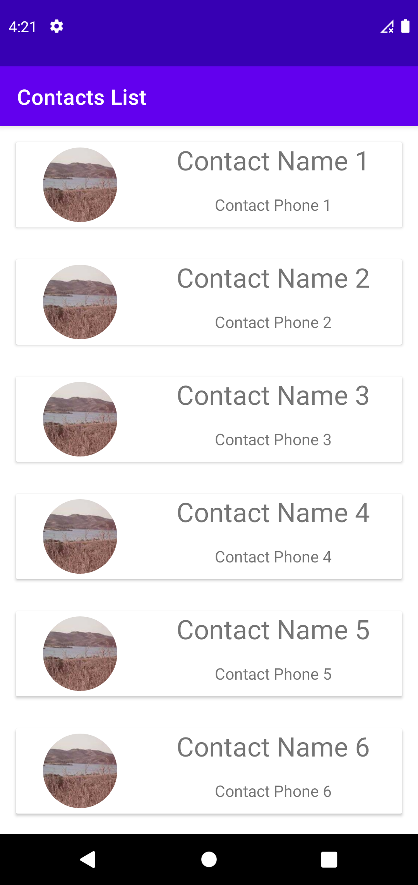

# Android Contact List App

This Android app is a simple contact list that allows users to view a list of contacts and their details. The app contains two activities: Contact List and Contact Details.

## Features

* View a list of contacts with their names and profile pictures
* View contact details such as phone number and email address

## Dependencies

* [Butterknife](https://github.com/JakeWharton/butterknife) - Field and method binding for Android views
* [Glide](https://github.com/bumptech/glide) - Image loading and caching library for Android

## Screenshots
<!-- resize images -->

## Installation

To install and run the app, follow these steps:

1. Clone the repository: `git clone https://github.com/KhaledElwazan/contact-list-app.git`
2. Open the project in Android Studio
3. Build and run the app on your device or emulator

## Contributing

Contributions are always welcome! If you have any suggestions or find any bugs, please open an issue or submit a pull request.

## License

This project is licensed under the MIT License - see the [LICENSE](/LICENSE) file for details.
